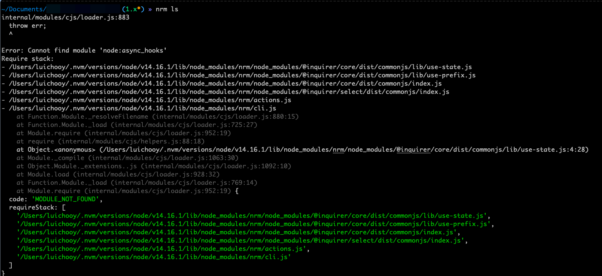

[nrm](https://segmentfault.com/a/1190000000473869)


## nrm不支持当前node版本的问题



如图，在node@14.16.1版本下安装nrm之后，运行nrm命令会出现报错，报错内容表示当前node不支持nrm源码中的node语法。

如果想要在node@14.16.1版本使用nrm，需要对nrm进行降级。经过测试，nrm@1.3.1版本是支持node@14.16.1的最高版本

```shell
npm i nrm@1.3.1 -g
```
