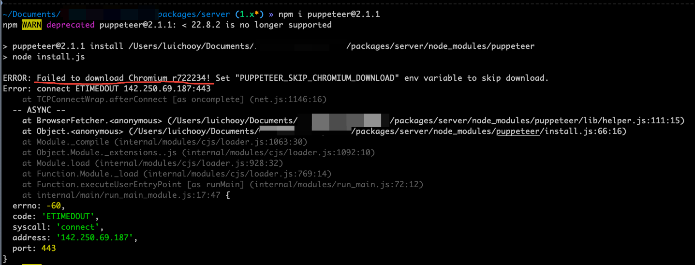
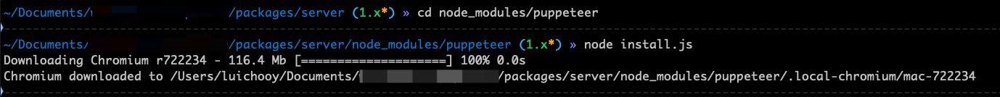

如图，安装puppeteer经常会遇到失败的情况



错误信息显示
```shell
ERROR: Failed to download Chromium r722234! Set "PUPPETEER_SKIP_CHROMIUM_DOWNLOAD" env variable to skip download.
Error: connect ETIMEDOUT 142.250.69.187:443
```
失败原因是安装puppeteer的过程中会去下载Chromium, 而这个过程会经常失败

目前找到的一种解决方式是：

**第一步**
跳过下载CHROMIUM直接安装puppeteer
```shell
PUPPETEER_SKIP_CHROMIUM_DOWNLOAD=true npm install puppeteer
```

**第二步**
进入到node_modules/puppeteer目录下，手动执行install.js
```shell
cd node_modules/puppeteer

node install.js
```

这样通常就可以解决下载失败的问题了
